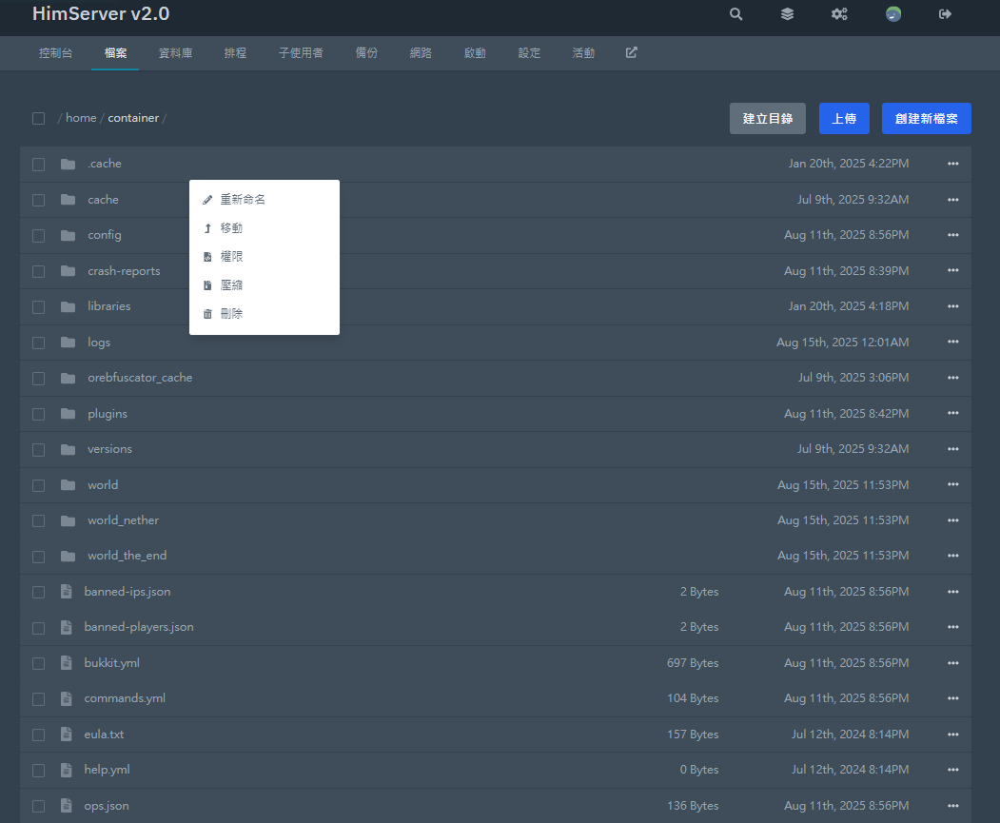
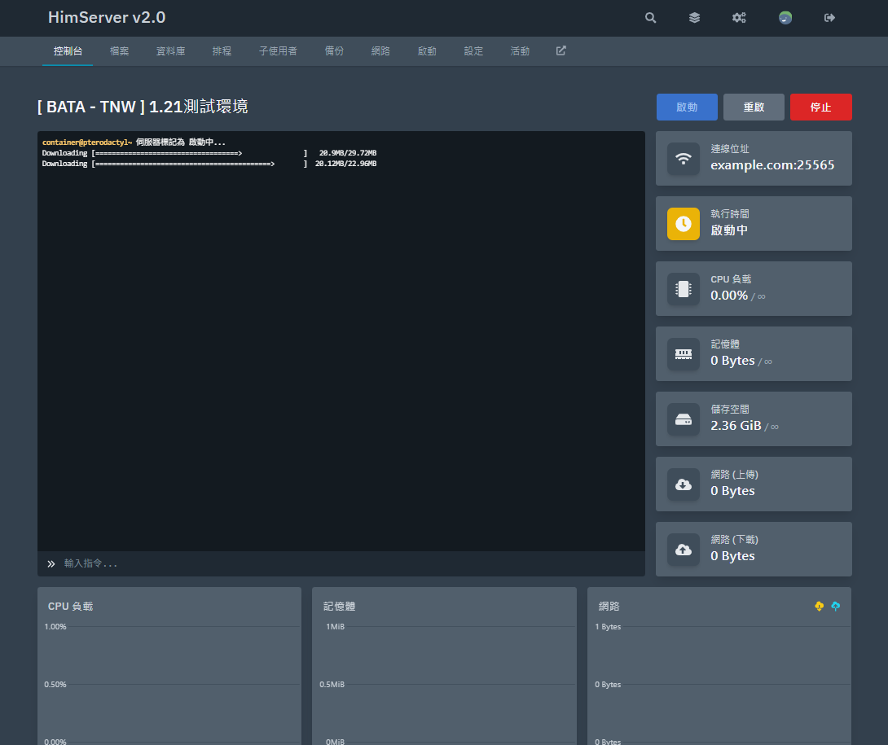
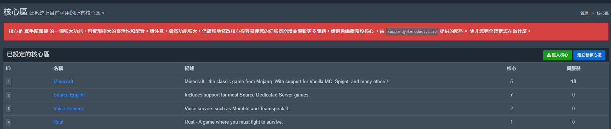
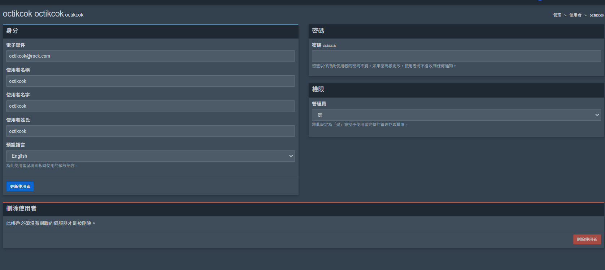
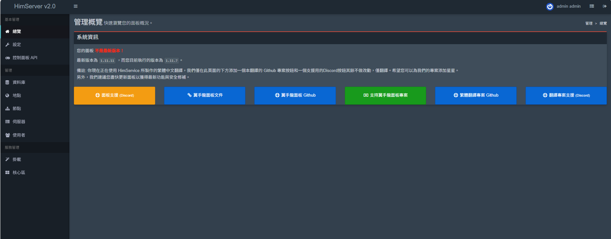
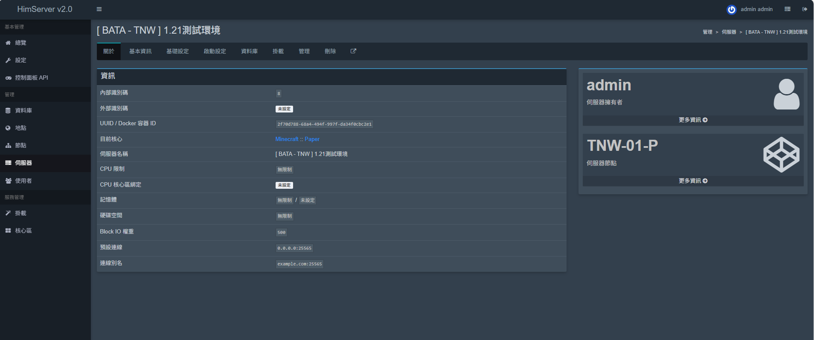
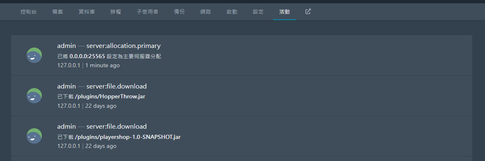
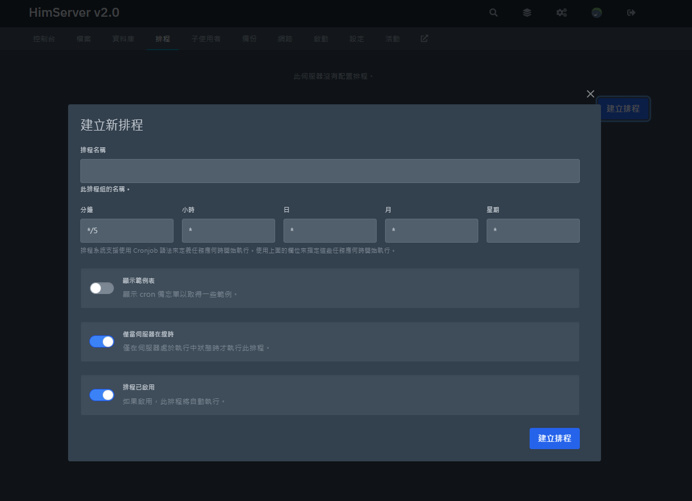

# Jexactyl-Panel-繁體中文翻譯
這是一個適用於翼手龍面板的繁體中文翻譯檔案，可將您的翼手龍面板幾乎翻譯成繁體中文顯示。其他版本仍在翻譯中!

---

## 當前製作的版本
- 3.7.3 製作完畢，測試中

---

## 安裝注意事項
請確保版本正確，並已備份面板的resources資料夾

## 安裝方式
您可以選擇兩種安裝方式，腳本安裝或手動安裝翻譯

### 腳本安裝
使用腳本安裝可以更加快速的安裝翻譯內容，您只需要指定版本與面板路徑，腳本將自動安裝、備份、替換、編譯面板

```bash
bash <(curl -sSL https://raw.githubusercontent.com/HimService/Jexactyl-Panel-Traditional-Chinese/main/install.sh)
```

---

### 手動安裝
手動安裝可以確保安裝彈性，但速度較慢。

將指定版本的翻譯檔案下載，下載完畢後將面板內的resources資料夾備份後移除並替換成翻譯檔案內的resources資料夾
隨後進行以下操作(使用1.11.7版本演示)
```bash

cd /var/www/Jexactyl
yarn install --pure-lockfile
export NODE_OPTIONS=--openssl-legacy-provider # for NodeJS v17+
yarn build:production

```

編譯完成後請輸入
```bash

cd /var/www/Jexactyl

sudo chown -R www-data:www-data storage bootstrap/cache

sudo chmod -R 775 storage bootstrap/cache

# 清除 Laravel 快取
sudo -u www-data php artisan cache:clear
sudo -u www-data php artisan config:clear
sudo -u www-data php artisan view:clear
sudo -u www-data php artisan route:clear

```
恭喜，您已完成面板翻譯替換作業

---

## 備註
除了翻譯，我們僅在管理後台的概覽介面添加專案按鈕與文字，其餘與原版相同不做更改，僅做翻譯。

---
## 演示圖片
### 檔案管理介面

### 控制台介面

### 核心管理介面

### 用戶管理介面

### 後台管理介面

### 伺服管理介面

### 控制台日誌介面

### 排程介面


